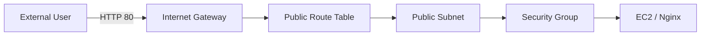

# B6-1 Round 01 — Beginner Guide

구분: **필수 미션 (REQUIRED)**  
Phase: **A — REFERENCE BUILD**  
Runtime Mission 상태: **⬜ NOT STARTED**

이 문서는 공식 `b6-1-mission.md`와 `b6-1-evaluation.md`를 기준으로 Phase C에서 실제 AWS 환경을 한 단계씩 검증하기 위한 기준 경로입니다. Reference 문서가 준비되어도 AWS 리소스와 외부 접속을 실제 확인하기 전에는 `✅ CLEAR`가 아닙니다.

## 00. 미션 한눈에 보기

B6-1은 단순히 EC2 한 대를 띄우는 미션이 아닙니다.

```text
Internet
→ Internet Gateway
→ Public Route Table
→ Public Subnet
→ Security Group
→ EC2
→ Nginx :80
```

여기에 IAM 최소권한, 트러블슈팅, 리소스 정리까지 연결해야 합니다.

## 01. 공식 최종 결과물

Phase C에서 실제로 준비해야 하는 네 가지입니다.

1. `docs/architecture.png` 또는 `docs/architecture.pdf`
2. 외부 접속 결과 + README의 방식 A/B 및 URL/IP
3. `docs/troubleshooting.md` 실제 사례 1건 이상
4. `docs/cleanup-checklist.md` 실제 정리 완료 기록

Reference의 `architecture.mmd`는 설계 원본이며 공식 PNG/PDF를 대신하지 않습니다.

## 02. Golden Path

Reference 설계는 다음 기준을 사용합니다.

```text
AWS Region: ap-northeast-2 (Seoul)
VPC:        10.10.0.0/16
Public Subnet: 10.10.1.0/24
EC2:        Ubuntu LTS / free-tier eligible micro class
Web:        Nginx TCP 80
HTTP:       0.0.0.0/0 → 80
SSH:        MY_PUBLIC_IP/32 → 22
External check: GET /health → 200 OK
```

실제 인스턴스 타입과 프리티어 대상 여부는 Phase C 실행 시 AWS 콘솔에서 현재 계정 조건을 확인합니다.

## 03. 반드시 알아야 할 용어

### 가상 사설 클라우드 (Virtual Private Cloud, VPC)
AWS 안에서 내가 사용하는 격리된 네트워크 영역입니다. B6-1의 Subnet, Route Table, EC2가 이 안에 들어갑니다.

### 서브넷 (Subnet)
VPC 주소 범위를 더 작은 네트워크로 나눈 것입니다. B6-1은 외부 통신이 가능한 Public Subnet 하나를 사용합니다.

### 인터넷 게이트웨이 (Internet Gateway, IGW)
VPC와 인터넷을 연결하는 출입구입니다.

### 라우트 테이블 (Route Table)
목적지에 따라 패킷을 어디로 보낼지 정하는 규칙표입니다. Public Subnet에는 `0.0.0.0/0 → IGW`가 필요합니다.

### 보안 그룹 (Security Group, SG)
EC2 앞에서 허용할 네트워크 트래픽을 정하는 상태 기반 방화벽입니다.

### IAM (Identity and Access Management)
누가 AWS 리소스에 어떤 API 작업을 할 수 있는지 정하는 권한 체계입니다. SG는 네트워크 접근, IAM은 AWS 작업 권한을 담당합니다.

### 최소 권한 (Least Privilege)
필요한 작업에 필요한 권한만 허용하는 원칙입니다. `AdministratorAccess`를 주지 않습니다.

### 퍼블릭 IPv4 (Public IPv4)
인터넷에서 EC2로 접근할 때 사용하는 공인 주소입니다.

## 04. 핵심 개념도



외부 요청이 성공하려면 한 지점만 맞아서는 안 됩니다. IGW, Route, Public IP, SG, 서버 프로세스가 모두 맞아야 합니다.

## 05. Reference 자료

```text
training/round-01-clear/
├── reference/
│   ├── nginx/default.conf
│   └── iam/least-privilege.md
├── docs/
│   ├── architecture.mmd
│   ├── requirements-mapping.md
│   ├── evaluation-qa.md
│   ├── troubleshooting.md
│   └── cleanup-checklist.md
├── environment/
│   ├── README.md
│   └── verify.sh
└── evidence/README.md
```

## 06. Nginx Reference

`reference/nginx/default.conf`은 두 경로를 제공합니다.

```text
/        → 정적 파일
/health  → HTTP 200 + OK
```

Phase C에서 EC2에 적용한 뒤 반드시 다음을 실제 확인합니다.

```bash
sudo nginx -t
systemctl status nginx --no-pager
curl -i http://localhost/
curl -i http://localhost/health
```

## 07. Security Group 원칙

필수 인바운드는 다음 두 개가 중심입니다.

```text
TCP 80 ← 0.0.0.0/0
TCP 22 ← MY_PUBLIC_IP/32
```

금지:

```text
TCP 22 ← 0.0.0.0/0
ALL traffic ← 0.0.0.0/0
```

DB 포트도 이번 미션에서 필요하지 않으므로 열지 않습니다.

## 08. IAM 원칙

Reference의 `reference/iam/least-privilege.md`에서 다음을 확인합니다.

- EC2/VPC/SG 실습에 필요한 작업 중심
- S3/RDS 등 무관한 서비스 권한 제외
- `AdministratorAccess` 제외
- Access Key / Secret Access Key / Session Token을 GitHub, 채팅, Evidence에 기록하지 않음

## 09. Phase C — STEP 01 현재 AWS 계정/리전 확인

### ① 왜 하는가
잘못된 Region이나 Root 계정에서 리소스를 만들면 요구사항과 비용 관리가 꼬일 수 있습니다.

### ② 무엇을 하는가
서울 Region과 IAM principal 사용 여부를 확인합니다.

### ③ 용어
- Region: AWS 데이터센터 지역 단위
- IAM principal: AWS 작업 권한을 가진 User 또는 Role

### ④ 핵심 개념
B6-1의 모든 리소스는 `ap-northeast-2`에 있어야 합니다.

### ⑤ 실행 예

```bash
aws configure get region
aws sts get-caller-identity
```

### ⑥ 명령 해설
첫 명령은 CLI Region을, 두 번째는 현재 AWS 주체를 확인합니다.

### ⑦ 예상 정상 결과
Region이 `ap-northeast-2`이고 Root가 아닌 IAM User/Role 계정입니다.

### ⑧ 의미
이후 리소스를 서울 Region의 같은 실습 범위로 추적할 수 있습니다.

### ⑨ 오류
Credential 값 자체는 출력/공유하지 않습니다. 계정 번호도 Evidence에 필요하지 않으면 마스킹합니다.

### ⑩ 완료 확인
Region/IAM principal 확인 후 다음 단계로 이동합니다.

## 10. Phase C — STEP 02 Network 생성/검증

순서:

```text
VPC
→ Public Subnet
→ Internet Gateway attach
→ Route Table
→ 0.0.0.0/0 → IGW
→ Route Table ↔ Public Subnet association
```

이 단계에서 리소스 ID를 기록합니다.

```text
B6_VPC_ID
B6_SUBNET_ID
B6_IGW_ID
B6_ROUTE_TABLE_ID
```

## 11. Phase C — STEP 03 Security Group

HTTP 80은 외부 공개, SSH 22는 현재 학습자 Public IP/32만 허용합니다.

현재 Public IP가 바뀌면 SSH가 막힐 수 있습니다. 이때 `0.0.0.0/0`로 넓히지 말고 현재 IP/32로 수정합니다.

## 12. Phase C — STEP 04 EC2 + SSH

EC2는 Public Subnet에 생성하고 Public IPv4를 확인합니다.

실제 확인:

```text
Instance state = running
Subnet = B6 Public Subnet
Security Group = B6 SG
Public IPv4 존재
SSH 실제 접속 성공
```

Private Key는 Git에 올리지 않습니다.

## 13. Phase C — STEP 05 Nginx / 내부 통신

EC2 안에서 Nginx를 설치하고 Reference 설정을 적용합니다.

검증:

```bash
sudo nginx -t
sudo systemctl reload nginx
curl -i http://localhost/health
curl -I https://example.com
ss -lntp | grep ':80'
```

여기서 확인하는 것은 각각 설정 문법, Nginx 동작, localhost HTTP, outbound Internet, TCP 80 LISTEN입니다.

## 14. Phase C — STEP 06 외부 접속

Reference 권장은 공식 방식 B입니다.

```bash
curl -i http://<PUBLIC_IP>/health
```

정상 예:

```text
HTTP/1.1 200 OK
...
OK
```

README에는 `방식 B`, URL/IP와 결과를 기록합니다.

## 15. Phase C — STEP 07 Troubleshooting

문제가 생기면 다음 순서를 권장합니다.

```text
1. Route / IGW
2. Security Group
3. Public IP / DNS
4. EC2 내부 서버 프로세스 / 로그
```

보고서는 반드시 실제 사례를 다음 구조로 기록합니다.

```text
Symptom
→ Hypothesis
→ Verification
→ Action
→ Result
→ Recurrence Prevention
```

설정을 여러 개 동시에 바꾸면 원인을 알 수 없으므로 한 가설씩 검증합니다.

## 16. Phase C — STEP 08 Architecture 제출본

Reference `architecture.mmd`를 실제 resource 정보에 맞게 확인한 뒤 `docs/architecture.png` 또는 `docs/architecture.pdf`로 렌더링합니다.

필수 요소:

```text
VPC
Public Subnet
Internet Gateway
Route Table
EC2
Security Group
External → Service traffic flow
```

## 17. Phase C — STEP 09 Cleanup

Evidence를 모두 확보한 뒤 `docs/cleanup-checklist.md`에 따라 정리합니다.

최소 필수 확인 5종:

```text
EC2
EBS
Elastic IP
Internet Gateway
VPC
```

생성하지 않은 EIP는 “미생성/없음 확인”으로 근거를 남기고, 실제 생성한 리소스는 삭제/Release 상태를 확인합니다.

## 18. 자동 Verification

Reference 구조 점검:

```bash
bash training/round-01-clear/environment/verify.sh
```

Runtime 읽기 전용 검증:

```bash
export AWS_REGION=ap-northeast-2
export B6_VPC_ID=...
export B6_SUBNET_ID=...
export B6_IGW_ID=...
export B6_ROUTE_TABLE_ID=...
export B6_SG_ID=...
export B6_INSTANCE_ID=...
export B6_PUBLIC_IP=...
export B6_SSH_CIDR=x.x.x.x/32
bash training/round-01-clear/environment/verify.sh --runtime
```

위 값은 Secret Key가 아닙니다. 단, AWS Access Key/Secret/Token은 절대 문서에 넣지 않습니다.

## 19. Runtime Evidence

Phase C에서 다음 실제 Evidence가 필요합니다.

```text
evidence/runtime/aws-network.txt
evidence/runtime/server.txt
evidence/runtime/ssh.txt
evidence/runtime/iam.md
evidence/runtime/external.txt
evidence/runtime/evaluation.md
docs/architecture.png 또는 .pdf
docs/troubleshooting.md 실제 기록
docs/cleanup-checklist.md 실제 완료 기록
```

## 20. CLEAR Gate

```text
Network actual
+ SG actual
+ EC2/SSH actual
+ localhost/outbound actual
+ external HTTP actual
+ IAM least privilege actual
+ architecture artifact
+ troubleshooting actual
+ cleanup actual
+ evaluation explanation
= ✅ CLEAR
```

Cloud 미션은 코드/문서만으로 통과 처리하지 않습니다.
